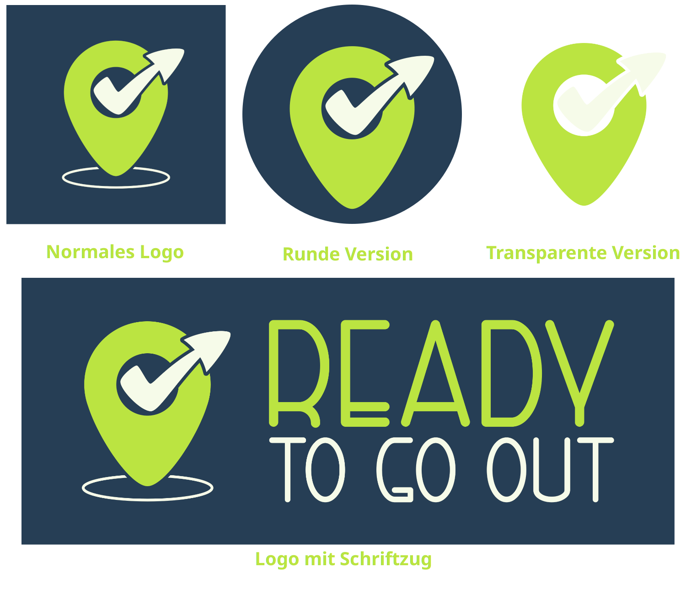

# Branding
Hier befinden sich alle Dateien die mit der Vermarktung von ready to go out zu tun haben.

## Erklärung der Ordner
- [css](css/): enthält Style-Dateien, die eingebunden werden können, um
die Resourcen aus den anderen Ordnern dieses Repositories in HTML verwenden zu können. Dazu 
muss dieses Repository als Submodule mit dem Namen "branding" eingebunden werden.
- [font](font/): enthält die von uns im Logo verwendete Schriftart namens "Righthand (bold)".
- [png](png/): enthält die PNG-Ressourcen, d.h. alle Bilder
- [svg](svg/): enthält die vektorisierten Ressourcen. SVG-Bilder haben den Vorteil,
beliebig skalierbar zu sein, ohne unscharf dargestellt zu werden. Der Name einer SVG-Datei stimmt mit dem der entsprechenden PNG-Ressource überein.

## Logos

### [Normales Logo](png/logo.png)
Normales logo für alle Zwecke.

### [Runde Version](png/logo_simpel.png)
Runde Version für alle Zecke, bei denen das eckige Logo nicht geeignet ist.
Dieses Logo besitzt den kleinen weißen Ring nicht, und ist deshalb simpler.
Das "offizielle" Logo ist daher das eckige.

### [Transparente Version](png/logo_simpel_transparent.png)
Transparente und ebenfalls simple Version, die als Icon verwendet werden kann.
Diese Version ist praktisch, wenn man das Logo eher klein anzeigen lassen möchte,
sie wird zum Beispiel als Webseiten-Icon verwendet.

### [Logo mit Schriftzug](png/logo_schrift.png)
Logo inklusive des Namens als Schriftzug daneben. Die Schriftart alleine ist
[hier](font/righthand-bold-personal.ttf) zu finden und heißt "Righthand (bold)".

#### Weitere Versionen
[weiße Version](png/logo_weiß.png)

## Farben
- Blauton: #263e55;
- dunklere Version des Blautons: #172533;
- Grünton: #bbe441;
- Weißton: #f6fbe9;
